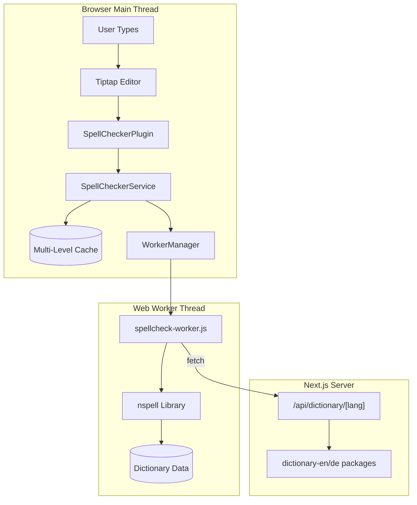
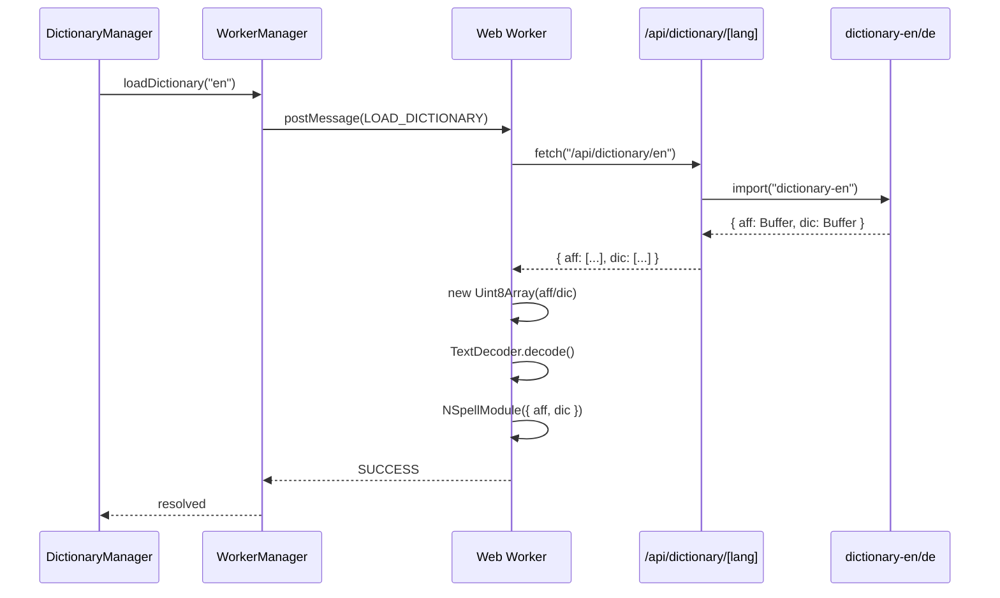

# SpellChecker Technical Deep Dive

A comprehensive technical document explaining exactly how the spellchecker works, from the moment you type a character to when a red underline appears under misspelled words.

**Target audience:** Developers who need to understand, debug, or extend the spellchecker implementation.

---

## Table of Contents

1. [Executive Summary](#executive-summary)
2. [The 10,000-Foot View](#the-10000-foot-view)
3. [Complete Walkthrough: From Keystroke to Red Underline](#complete-walkthrough-from-keystroke-to-red-underline)
4. [Understanding nspell and Hunspell](#understanding-nspell-and-hunspell)
5. [The Caching Architecture](#the-caching-architecture)
6. [The Generation Pattern (Race Condition Prevention)](#the-generation-pattern-race-condition-prevention)
7. [Dictionary Loading Pipeline](#dictionary-loading-pipeline)
8. [React Context and UI Communication](#react-context-and-ui-communication)
9. [Architecture Pros and Cons](#architecture-pros-and-cons)
10. [File-by-File Reference](#file-by-file-reference)
11. [Code Path Example](#code-path-example)

---

## Executive Summary

The SpellChecker extension provides real-time spell checking for Tiptap editors by:

1. **Detecting word boundaries** as you type (spaces, punctuation)
2. **Extracting completed words** from the document
3. **Checking spelling** via a Web Worker running the nspell library (Hunspell-compatible)
4. **Displaying visual feedback** using ProseMirror decorations (red underlines)
5. **Providing suggestions** via a right-click context menu

**Key architectural decisions:**
- Web Worker for non-blocking spell checks (prevents UI jank)
- Multi-level caching for 90%+ cache hit rates
- Generation pattern to handle race conditions during async operations
- React Context for scoped UI state per editor instance

---

## The 10,000-Foot View

The spellchecker is organized into distinct layers, each with a specific responsibility:

```
┌─────────────────────────────────────────────────────────────────────────────┐
│                              BROWSER                                         │
│  ┌───────────────────────────────────────────────────────────────────────┐  │
│  │                         MAIN THREAD                                    │  │
│  │                                                                        │  │
│  │  ┌──────────────┐    ┌─────────────────────┐    ┌──────────────────┐  │  │
│  │  │   Tiptap     │───▶│ SpellCheckerPlugin  │───▶│ SpellChecker     │  │  │
│  │  │   Editor     │    │ (ProseMirror)       │    │ Service          │  │  │
│  │  └──────────────┘    └─────────────────────┘    └────────┬─────────┘  │  │
│  │         │                      │                         │            │  │
│  │         │                      │                   ┌─────┴─────┐      │  │
│  │         ▼                      ▼                   │           │      │  │
│  │  ┌──────────────┐    ┌─────────────────────┐      │  CACHES   │      │  │
│  │  │ React        │    │ DecorationSet       │      │           │      │  │
│  │  │ Context      │    │ (red underlines)    │      └─────┬─────┘      │  │
│  │  └──────────────┘    └─────────────────────┘            │            │  │
│  │         │                                               │            │  │
│  │         ▼                                               ▼            │  │
│  │  ┌──────────────┐                            ┌──────────────────┐    │  │
│  │  │ ContextMenu  │                            │  WorkerManager   │    │  │
│  │  │ (suggestions)│                            │  (message queue) │    │  │
│  │  └──────────────┘                            └────────┬─────────┘    │  │
│  │                                                       │              │  │
│  └───────────────────────────────────────────────────────┼──────────────┘  │
│                                                          │                  │
│  ┌───────────────────────────────────────────────────────┼──────────────┐  │
│  │                         WEB WORKER THREAD             │              │  │
│  │                                                       ▼              │  │
│  │                                            ┌──────────────────┐      │  │
│  │                                            │ spellcheck-      │      │  │
│  │                                            │ worker.js        │      │  │
│  │                                            └────────┬─────────┘      │  │
│  │                                                     │                │  │
│  │                                                     ▼                │  │
│  │                                            ┌──────────────────┐      │  │
│  │                                            │  nspell library  │      │  │
│  │                                            │  (Hunspell)      │      │  │
│  │                                            └────────┬─────────┘      │  │
│  │                                                     │                │  │
│  │                                                     ▼                │  │
│  │                                            ┌──────────────────┐      │  │
│  │                                            │ Dictionary Data  │      │  │
│  │                                            │ (.aff + .dic)    │      │  │
│  │                                            └──────────────────┘      │  │
│  └──────────────────────────────────────────────────────────────────────┘  │
└─────────────────────────────────────────────────────────────────────────────┘
                                      │
                                      │ HTTP (fetch dictionary)
                                      ▼
┌─────────────────────────────────────────────────────────────────────────────┐
│                           NEXT.JS SERVER                                     │
│                                                                              │
│  ┌──────────────────────────┐    ┌──────────────────────────────────────┐   │
│  │  /api/dictionary/[lang]  │───▶│  dictionary-en / dictionary-de       │   │
│  │  (API Route)             │    │  (npm packages)                      │   │
│  └──────────────────────────┘    └──────────────────────────────────────┘   │
└─────────────────────────────────────────────────────────────────────────────┘
```

### Mermaid Diagram



### Layer Responsibilities

| Layer | Components | Responsibility |
|-------|------------|----------------|
| **UI Layer** | SpellCheckerUI, ContextMenu, Controls | User interaction, visual feedback |
| **Context Layer** | SpellCheckerProvider | Scoped state per editor instance |
| **Extension Layer** | SpellCheckerExtension, SpellCheckerPlugin | Tiptap/ProseMirror integration |
| **Service Layer** | SpellCheckerService, DictionaryManager, WorkerManager | Caching, batching, coordination |
| **Worker Layer** | spellcheck-worker.js, nspell | Actual spell checking computation |
| **Server Layer** | API Route | Dictionary file serving |

---

## Complete Walkthrough: From Keystroke to Red Underline

Let's trace **exactly** what happens when a user types `"helllo world "` (note the misspelling and the trailing space).

### Phase 1: Document Change Detection

When the user types, Tiptap/ProseMirror creates a **transaction** representing the document change. The SpellCheckerPlugin receives this in its `update()` function:

```typescript
// SpellCheckerPlugin.ts - view.update()
update: (view, prevState) => {
  // Skip if disabled
  if (!options.getEnabled()) {
    return
  }

  // Scan on document changes at word boundaries
  if (view.state.doc !== prevState.doc) {
    const currentText = view.state.doc.textContent
    const prevText = prevState.doc.textContent
    
    if (currentText.length > prevText.length) {
      // Text was added - check if last character is a word boundary
      const lastChar = currentText.slice(-1)
      const isWordBoundary = /[\s\n.,!?;:]/.test(lastChar)
      if (isWordBoundary) {
        scheduleScan()  // <-- This triggers the spell check
      }
    } else {
      // Text deleted - always rescan
      scheduleScan()
    }
  }
}
```

**Key insight:** We only scan when a word boundary is detected. This prevents checking incomplete words while the user is still typing "hel" → "hell" → "hello".

### Phase 2: Debounced Scan Scheduling

The `scheduleScan()` function implements debouncing:

```typescript
const scheduleScan = () => {
  // Clear any pending scan
  if (scanTimeout) {
    clearTimeout(scanTimeout)
  }
  
  // Capture generation at scan start (for race condition prevention)
  const scanGeneration = options.getScanGeneration()
  const scanLanguage = options.getLanguage()

  // Wait 400ms before actually scanning
  scanTimeout = setTimeout(async () => {
    // Check if state changed during debounce period
    if (options.getScanGeneration() !== scanGeneration) {
      return  // Abort - user switched language or toggled off
    }
    
    // Now perform the actual scan
    const newDecorations = await scanDocument(...)
    // ... apply decorations
  }, DEFAULT_DEBOUNCE_MS)  // 400ms
}
```

**Why debounce?**
- User types "hello world" rapidly
- Without debounce: 11 scans (one per character)
- With 400ms debounce: 1-2 scans (after pauses)

### Phase 3: Word Extraction

After the debounce period, `scanDocument()` extracts words using `extractWords()`:

```typescript
// wordExtractor.ts
export function extractWords(doc: ProseMirrorNode): WordPosition[] {
  const words: WordPosition[] = []
  const wordBoundaryRegex = /\b[\w'-]+\b/g

  doc.descendants((node, pos) => {
    // Skip code blocks
    if (node.type.name === 'codeBlock' || node.type.name === 'code') {
      return false
    }

    if (node.isText) {
      const text = node.text || ''
      let match: RegExpExecArray | null

      while ((match = wordBoundaryRegex.exec(text)) !== null) {
        const word = match[0]
        const indexAfterWord = match.index + word.length

        // CRITICAL: Only include words with trailing boundary
        // This prevents checking "hel" while user is typing "hello"
        const hasTrailingBoundary =
          indexAfterWord < text.length &&
          /[\s\n.,!?;:'")\]}]/.test(text[indexAfterWord])

        if (shouldCheckWord(word) && hasTrailingBoundary) {
          words.push({
            word: word,
            from: pos + match.index,
            to: pos + match.index + word.length,
          })
        }
      }
    }
    return true
  })

  return words
}
```

**For `"helllo world "`:**
- Returns: `[{ word: "helllo", from: 0, to: 6 }, { word: "world", from: 7, to: 12 }]`
- Note: Both words have trailing boundaries (space after each)

### Phase 4: Cache Lookup

The extracted words go to `SpellCheckerService.checkWords()`:

```typescript
// SpellCheckerService.ts
async checkWords(words: string[], language: LanguageCode): Promise<Map<string, boolean>> {
  // Get language-specific caches
  const correctCache = this.getCorrectWordsCache(language)
  const misspelledCache = this.getMisspelledWordsCache(language)
  
  const wordsToCheck: string[] = []
  const results = new Map<string, boolean>()
  
  for (const word of words) {
    const normalized = word.toLowerCase()
    
    // Check caches first
    if (correctCache.has(normalized)) {
      results.set(word, true)  // Cache hit - word is correct
      continue
    }
    if (misspelledCache.has(normalized)) {
      results.set(word, false)  // Cache hit - word is misspelled
      continue
    }
    
    // Cache miss - need to check with worker
    wordsToCheck.push(word)
  }
  
  if (wordsToCheck.length > 0) {
    // Send uncached words to worker
    const workerResults = await this.workerManager.checkWords(wordsToCheck, language)
    
    // Update caches and results
    for (const [word, isCorrect] of workerResults.entries()) {
      const normalized = word.toLowerCase()
      if (isCorrect) {
        correctCache.add(normalized)
      } else {
        misspelledCache.add(normalized)
      }
      results.set(word, isCorrect)
    }
  }
  
  return results
}
```

**First scan of "helllo world":**
- Cache miss for both words
- Sends both to worker

**Second scan (user edits something else):**
- "world" found in `correctWordsCache` → no worker call
- "helllo" found in `misspelledWordsCache` → no worker call
- **90%+ cache hit rate** in typical documents

### Phase 5: Worker Communication

`WorkerManager` handles the message passing:

```typescript
// WorkerManager.ts
async checkWords(words: string[], expectedLanguage?: string): Promise<Map<string, boolean>> {
  // Verify language if provided (prevents race conditions)
  if (expectedLanguage) {
    const currentLang = await this.getCurrentLanguage()
    if (currentLang !== expectedLanguage) {
      throw new Error(`Language mismatch: expected ${expectedLanguage}, got ${currentLang}`)
    }
  }
  
  // Send message with unique request ID
  const requestId = `req_${++this.requestCounter}_${Date.now()}`
  
  return new Promise((resolve, reject) => {
    // Set timeout
    const timeout = setTimeout(() => {
      reject(new Error('Request timeout'))
    }, 30000)
    
    // Store pending request
    this.pendingRequests.set(requestId, { resolve, reject, timeout })
    
    // Send to worker
    this.worker.postMessage({
      type: 'CHECK_WORDS',
      requestId,
      words
    })
  })
}
```

The Web Worker receives this and processes it:

```javascript
// spellcheck-worker.js
self.onmessage = async function(e) {
  const { type, requestId, ...data } = e.data
  
  switch (type) {
    case 'CHECK_WORDS':
      const results = {}
      for (const word of data.words) {
        results[word] = checkWord(word)
      }
      self.postMessage({
        type: 'SUCCESS',
        requestId,
        data: results
      })
      break
  }
}
```

### Phase 6: nspell Spell Checking

The worker's `checkWord()` function uses nspell:

```javascript
// spellcheck-worker.js
function checkWord(word) {
  const trimmed = word.trim()
  
  // Skip very short words
  if (trimmed.length < 2) {
    return true
  }

  // Check original case first (handles proper nouns like "Monday")
  if (spellchecker.correct(trimmed)) {
    return true
  }

  // Fall back to lowercase (handles "HELLO" → "hello")
  const lowercase = trimmed.toLowerCase()
  if (lowercase !== trimmed) {
    return spellchecker.correct(lowercase)
  }

  return false
}
```

**For our words:**
- `checkWord("helllo")` → `spellchecker.correct("helllo")` → `false`
- `checkWord("world")` → `spellchecker.correct("world")` → `true`

### Phase 7: Suggestion Fetching

For misspelled words, we fetch suggestions:

```typescript
// SpellCheckerPlugin.ts - scanDocument()
const misspelledWords = words.filter(w => !checkResults.get(w.word))

// Fetch suggestions for all misspelled words in parallel
const suggestionPromises = misspelledWords.map((wordPos) =>
  spellCheckerService.getSuggestions(wordPos.word, language).then((suggestions) => ({
    wordPos,
    suggestions,
  }))
)

const suggestionResults = await Promise.all(suggestionPromises)
```

The service ranks suggestions by edit distance:

```typescript
// SpellCheckerService.ts
async getSuggestions(word: string, language: LanguageCode): Promise<string[]> {
  // Get raw suggestions from worker
  const allSuggestions = await this.workerManager.getSuggestions(word, language)
  
  // Rank by Levenshtein distance
  const ranked = allSuggestions.map(suggestion => ({
    suggestion,
    distance: calculateEditDistance(word.toLowerCase(), suggestion.toLowerCase())
  }))
  
  // Sort by distance (lower is better)
  ranked.sort((a, b) => a.distance - b.distance)
  
  // Return top 5
  return ranked.slice(0, 5).map(r => r.suggestion)
}
```

**For "helllo":**
- nspell returns: `["hello", "jello", "cello", ...]`
- After ranking by edit distance: `["hello", ...]` (distance 1 vs 2+)

### Phase 8: Decoration Creation

Finally, we create ProseMirror decorations:

```typescript
// SpellCheckerPlugin.ts - scanDocument()
const decorations: Decoration[] = []

for (const { wordPos, suggestions } of suggestionResults) {
  // Only highlight words that have suggestions
  if (suggestions.length > 0) {
    decorations.push(
      Decoration.inline(wordPos.from, wordPos.to, {
        class: 'spellcheck-misspelled',  // CSS class for red underline
        'data-word': wordPos.word,
        'data-from': wordPos.from.toString(),
        'data-to': wordPos.to.toString(),
      })
    )
  }
}

return DecorationSet.create(doc, decorations)
```

The decoration is applied via a ProseMirror transaction:

```typescript
const tr = currentState.tr
  .setMeta('spellcheck-update-decorations', true)
  .setMeta('spellcheck-decorations', newDecorations)
  .setMeta('spellcheck-generation', scanGeneration)
view.dispatch(tr)
```

**Result:** "helllo" now has a red wavy underline!

```css
.spellcheck-misspelled {
  text-decoration: underline wavy #ef4444;
  text-decoration-skip-ink: none;
  text-underline-offset: 2px;
}
```

---

## Understanding nspell and Hunspell

### What is Hunspell?

Hunspell is the industry-standard open-source spell checker used by:
- Firefox
- Chrome
- LibreOffice
- macOS
- Many more applications

**nspell** is a JavaScript port of Hunspell that works in Node.js and browsers.

### Hunspell Dictionary Format

Hunspell dictionaries consist of two files:

#### 1. The `.aff` (Affix) File

Contains rules for word transformations:

```
# Example from English dictionary
SFX S Y 4                    # Suffix rule "S" with 4 entries
SFX S   0     s     [^sxzhy] # Add "s" if word doesn't end in s,x,z,h,y
SFX S   0     es    [sxzh]   # Add "es" if word ends in s,x,z,h
SFX S   y     ies   [^aeiou]y # Replace "y" with "ies"
SFX S   0     s     [aeiou]y  # Add "s" if word ends in vowel+y

PFX U Y 1                    # Prefix rule "U"
PFX U   0     un    .        # Add "un" to any word
```

This allows one dictionary entry like `happy/US` to expand to:
- happy
- happys (S suffix - though this is incorrect, real rules are more complex)
- unhappy (U prefix)
- unhappys

#### 2. The `.dic` (Dictionary) File

Contains base words with affix flags:

```
123456                    # Total word count
hello
world
happy/US                  # Can take U prefix and S suffix
run/GS                    # Can take G and S suffixes
```

### How nspell Checks Spelling

When you call `spellchecker.correct("unhappiness")`:

1. **Direct lookup**: Is "unhappiness" in the dictionary? No.
2. **Affix reduction**: Try removing affixes:
   - Remove "un-" prefix → "happiness"
   - Remove "-ness" suffix → "happy"
   - Is "happy" in dictionary with matching affix flags? Yes!
3. **Result**: Word is correct

**For "helllo":**
1. **Direct lookup**: No
2. **Affix reduction**: Can't reduce to any known base word
3. **Result**: Word is misspelled

### How nspell Generates Suggestions

When you call `spellchecker.suggest("helllo")`:

1. **Edit distance candidates**: Generate words within edit distance 1-2:
   - Delete: "hello", "hllo", "helo"...
   - Insert: "hellol", "heello"...
   - Replace: "jello", "hallo"...
   - Transpose: "hlello", "helol"...

2. **Affix expansion**: For each candidate, try affix expansions

3. **Dictionary filter**: Keep only words that exist in dictionary

4. **Ranking**: Sort by likelihood (based on edit distance and frequency)

### Why Use a Web Worker?

Spell checking is CPU-intensive:

| Operation | Typical Time |
|-----------|--------------|
| Load English dictionary | 200-500ms |
| Check one word (cache miss) | 1-5ms |
| Generate suggestions | 10-50ms |
| Check 100 words (batch) | 50-200ms |

**Without a Web Worker:**
```
User types → Main thread blocked → UI freezes → Janky experience
```

**With a Web Worker:**
```
User types → Worker checks spelling → Main thread free → Smooth typing
```

---

## The Caching Architecture

The SpellCheckerService implements a multi-level caching system:

```
┌─────────────────────────────────────────────────────────────────────────────┐
│                           CACHE HIERARCHY                                    │
├─────────────────────────────────────────────────────────────────────────────┤
│                                                                              │
│  LEVEL 1: Correct Words Cache                                               │
│  ┌─────────────────────────────────────────────────────────────────────┐    │
│  │  correctWordsCache: Map<LanguageCode, Set<string>>                  │    │
│  │                                                                      │    │
│  │  Structure:                                                          │    │
│  │    "en" → Set { "hello", "world", "the", "and", ... }              │    │
│  │    "de" → Set { "hallo", "welt", "und", ... }                      │    │
│  │                                                                      │    │
│  │  Purpose: Fast lookup for known correct words                       │    │
│  │  Hit ratio: ~85-90% for typical documents                          │    │
│  │  Memory: ~500KB-1MB per language (average document)                │    │
│  └─────────────────────────────────────────────────────────────────────┘    │
│                                                                              │
│  LEVEL 2: Misspelled Words Cache                                            │
│  ┌─────────────────────────────────────────────────────────────────────┐    │
│  │  misspelledWordsCache: Map<LanguageCode, Set<string>>               │    │
│  │                                                                      │    │
│  │  Structure:                                                          │    │
│  │    "en" → Set { "teh", "recieve", "helllo", ... }                  │    │
│  │                                                                      │    │
│  │  Purpose: Avoid re-checking known misspellings                      │    │
│  │  Hit ratio: ~5-10%                                                  │    │
│  │  Memory: ~10-50KB (misspellings are rare)                          │    │
│  └─────────────────────────────────────────────────────────────────────┘    │
│                                                                              │
│  LEVEL 3: Suggestions Cache                                                  │
│  ┌─────────────────────────────────────────────────────────────────────┐    │
│  │  suggestionsCache: Map<string, string[]>                            │    │
│  │                                                                      │    │
│  │  Structure:                                                          │    │
│  │    "en:teh" → ["the", "tea", "ten", "eh", "tech"]                  │    │
│  │    "en:helllo" → ["hello", "jello", "cello", ...]                  │    │
│  │                                                                      │    │
│  │  Purpose: Expensive to compute, valuable to cache                   │    │
│  │  Key format: "language:word" for scoping                           │    │
│  │  Memory: ~1-5KB per misspelled word                                │    │
│  └─────────────────────────────────────────────────────────────────────┘    │
│                                                                              │
│  LEVEL 4: Pending Checks Deduplication                                      │
│  ┌─────────────────────────────────────────────────────────────────────┐    │
│  │  pendingChecks: Map<string, Promise<boolean>>                       │    │
│  │                                                                      │    │
│  │  Structure:                                                          │    │
│  │    "en:hello" → Promise<true>  (in-flight)                         │    │
│  │    "en:world" → Promise<true>  (in-flight)                         │    │
│  │                                                                      │    │
│  │  Purpose: Same word requested twice = single worker call            │    │
│  │  Lifetime: Cleared when promise resolves                           │    │
│  └─────────────────────────────────────────────────────────────────────┘    │
│                                                                              │
└─────────────────────────────────────────────────────────────────────────────┘
```

### Cache Flow Diagram

```
checkWord("hello", "en")
         │
         ▼
┌──────────────────────────────┐
│ Is "hello" in correctCache?  │──── YES ───▶ return true (FAST)
└──────────────────────────────┘
         │ NO
         ▼
┌──────────────────────────────┐
│ Is "hello" in misspelledCache│──── YES ───▶ return false (FAST)
└──────────────────────────────┘
         │ NO
         ▼
┌──────────────────────────────┐
│ Is "hello" in pendingChecks? │──── YES ───▶ return existing Promise
└──────────────────────────────┘
         │ NO
         ▼
┌──────────────────────────────┐
│ Create new Promise           │
│ Add to pendingChecks         │
│ Send to worker               │
└──────────────────────────────┘
         │
         ▼
    [Worker checks]
         │
         ▼
┌──────────────────────────────┐
│ Result: true                 │
│ Add to correctCache          │
│ Remove from pendingChecks    │
│ return true                  │
└──────────────────────────────┘
```

### Cache Invalidation Strategy

| Event | Action | Reason |
|-------|--------|--------|
| Language switch | Clear ALL caches | "hello" is correct in English, not German |
| Toggle off | Clear ALL caches | Clean slate when re-enabled |
| Document edit | Keep caches | Words don't change spelling |
| Suggestion fetch | Cache result | Expensive to recompute |

---

## The Generation Pattern (Race Condition Prevention)

### The Problem: Race Conditions

Spell checking is asynchronous. Consider this scenario:

```
T=0ms:   User is checking English document
T=10ms:  Scan starts for "hello world" (generation=1)
T=50ms:  User switches to German
T=51ms:  New generation (generation=2)
T=100ms: English scan results arrive
         → BUG: Would apply English results to German document!
```

### The Solution: Generation Counter

Every state change increments a generation counter:

```typescript
// SpellCheckerExtension.ts
addStorage() {
  return {
    enabled: true,
    language: 'en',
    scanGeneration: 0,  // <-- The generation counter
    // ...
  }
}

// Commands that change state increment generation:
toggleSpellChecker: (enabled) => {
  this.storage.scanGeneration++  // Increment!
  // ...
}

setSpellCheckerLanguage: (language) => {
  this.storage.scanGeneration++  // Increment!
  // ...
}
```

Every async operation captures and validates generation:

```typescript
// SpellCheckerPlugin.ts
const scheduleScan = () => {
  // 1. CAPTURE generation at start
  const scanGeneration = options.getScanGeneration()
  
  scanTimeout = setTimeout(async () => {
    // 2. CHECK before starting
    if (options.getScanGeneration() !== scanGeneration) {
      return  // Abort - state changed
    }
    
    const newDecorations = await scanDocument(...)
    
    // 3. CHECK after async operation
    if (options.getScanGeneration() !== scanGeneration) {
      return  // Abort - state changed during scan
    }
    
    // 4. Safe to apply results
    view.dispatch(tr.setMeta('spellcheck-decorations', newDecorations))
  }, 400)
}
```

### Generation Pattern Timeline (Fixed)

```
T=0ms:   User is checking English document
T=10ms:  Scan starts for "hello world"
         scanGeneration captured = 1
         
T=50ms:  User switches to German
         storage.scanGeneration++ → now 2
         
T=100ms: English scan results arrive
         Check: options.getScanGeneration() === 2
                scanGeneration === 1
                2 !== 1 → DISCARD RESULTS
         
T=110ms: German scan starts
         scanGeneration captured = 2
         
T=200ms: German scan results arrive
         Check: 2 === 2 → APPLY RESULTS ✓
```

---

## Dictionary Loading Pipeline

### Complete Sequence Diagram



### Step-by-Step Breakdown

```
┌─────────────────────────────────────────────────────────────────────────────┐
│                    DICTIONARY LOADING SEQUENCE                               │
└─────────────────────────────────────────────────────────────────────────────┘

1. Extension initializes
   │
   ▼
┌─────────────────────────────────────────────────────────────────────────────┐
│  DictionaryManager.loadDictionary("en")                                      │
│                                                                              │
│  // Check if already loaded                                                  │
│  if (loadedLanguages.has("en")) return  // Early exit                       │
│                                                                              │
│  // Check if already loading (deduplication)                                │
│  if (loadingPromises.has("en")) return loadingPromises.get("en")            │
└─────────────────────────────────────────────────────────────────────────────┘
   │
   ▼
┌─────────────────────────────────────────────────────────────────────────────┐
│  WorkerManager.loadDictionary("en")                                          │
│                                                                              │
│  // Create unique request ID                                                 │
│  requestId = "req_1_1705858800000"                                          │
│                                                                              │
│  // Post message to worker                                                   │
│  worker.postMessage({                                                        │
│    type: 'LOAD_DICTIONARY',                                                 │
│    requestId: 'req_1_1705858800000',                                        │
│    language: 'en'                                                           │
│  })                                                                          │
└─────────────────────────────────────────────────────────────────────────────┘
   │
   ▼
┌─────────────────────────────────────────────────────────────────────────────┐
│  Web Worker receives LOAD_DICTIONARY                                         │
│                                                                              │
│  // Fetch dictionary from API                                                │
│  const response = await fetch('/api/dictionary/en')                         │
│  const { aff, dic } = await response.json()                                 │
│  // aff and dic are number arrays (serialized Buffers)                      │
└─────────────────────────────────────────────────────────────────────────────┘
   │
   ▼
┌─────────────────────────────────────────────────────────────────────────────┐
│  Next.js API Route: /api/dictionary/[lang]/route.ts                         │
│                                                                              │
│  // Dynamic import of dictionary package                                     │
│  const dictionaryModule = await import('dictionary-en')                     │
│  const { aff, dic } = dictionaryModule.default                              │
│  // aff: Buffer (4.1MB), dic: Buffer (1.2MB)                               │
│                                                                              │
│  // Serialize for JSON transport                                             │
│  return NextResponse.json({                                                  │
│    aff: Array.from(aff),  // Convert Buffer to array                        │
│    dic: Array.from(dic)                                                      │
│  }, {                                                                        │
│    headers: { 'Cache-Control': 'max-age=31536000, immutable' }              │
│  })                                                                          │
└─────────────────────────────────────────────────────────────────────────────┘
   │
   ▼
┌─────────────────────────────────────────────────────────────────────────────┐
│  Web Worker processes dictionary data                                        │
│                                                                              │
│  // Convert arrays back to Uint8Array                                        │
│  const affUint8Array = new Uint8Array(aff)                                  │
│  const dicUint8Array = new Uint8Array(dic)                                  │
│                                                                              │
│  // Decode to strings                                                        │
│  const decoder = new TextDecoder('utf-8')                                   │
│  const affString = decoder.decode(affUint8Array)                            │
│  const dicString = decoder.decode(dicUint8Array)                            │
│                                                                              │
│  // Initialize nspell                                                        │
│  spellchecker = NSpellModule({ aff: affString, dic: dicString })            │
│  currentLanguage = 'en'                                                      │
└─────────────────────────────────────────────────────────────────────────────┘
   │
   ▼
┌─────────────────────────────────────────────────────────────────────────────┐
│  Success response sent back                                                  │
│                                                                              │
│  self.postMessage({                                                          │
│    type: 'SUCCESS',                                                          │
│    requestId: 'req_1_1705858800000',                                        │
│    data: { success: true }                                                   │
│  })                                                                          │
└─────────────────────────────────────────────────────────────────────────────┘
   │
   ▼
┌─────────────────────────────────────────────────────────────────────────────┐
│  WorkerManager receives SUCCESS                                              │
│                                                                              │
│  // Find pending request by ID                                               │
│  const pending = pendingRequests.get('req_1_1705858800000')                 │
│  pending.resolve()  // Resolves the Promise                                  │
└─────────────────────────────────────────────────────────────────────────────┘
   │
   ▼
┌─────────────────────────────────────────────────────────────────────────────┐
│  DictionaryManager updates state                                             │
│                                                                              │
│  loadedLanguages.add('en')  // Mark as loaded                               │
│  currentLanguage = 'en'                                                      │
└─────────────────────────────────────────────────────────────────────────────┘
```

### HTTP Caching

The API route sets aggressive caching headers:

```typescript
response.headers.set('Cache-Control', 'public, max-age=31536000, immutable')
```

This means:
- **First load**: 200-500ms (network + parsing)
- **Subsequent loads**: Near instant (HTTP cache hit)
- **Cache duration**: 1 year

---

## React Context and UI Communication

### The Problem with Global Events

Previously, the plugin communicated with React using window events:

```typescript
// Old approach (problematic)
window.dispatchEvent(new CustomEvent('spellcheck-context-menu', { detail: state }))
```

**Problem:** With multiple editors on the same page, ALL ContextMenu components receive the event.

### The Solution: React Context

Each editor gets its own scoped context:

```typescript
// SpellCheckerContext.tsx
interface SpellCheckerContextValue {
  contextMenu: ContextMenuState | null
  dismissContextMenu: () => void
  fixWord: (from: number, to: number, replacement: string) => void
  fixAllInstances: (word: string, replacement: string) => void
}

export function SpellCheckerProvider({ editor, children }) {
  const [contextMenu, setContextMenu] = useState<ContextMenuState | null>(null)

  useEffect(() => {
    if (!editor) return

    // Register callback with extension storage
    const ext = editor.extensionManager.extensions.find(e => e.name === 'spellChecker')
    if (ext?.storage) {
      ext.storage.onContextMenuChange = setContextMenu  // Direct callback!
    }

    return () => {
      if (ext?.storage) ext.storage.onContextMenuChange = undefined
    }
  }, [editor])

  return (
    <SpellCheckerContext.Provider value={{ contextMenu, dismissContextMenu, ... }}>
      {children}
    </SpellCheckerContext.Provider>
  )
}
```

### Communication Flow

```
┌─────────────────────────────────────────────────────────────────────────────┐
│                    CONTEXT MENU COMMUNICATION                                │
└─────────────────────────────────────────────────────────────────────────────┘

1. User right-clicks on misspelled word
   │
   ▼
┌─────────────────────────────────────────────────────────────────────────────┐
│  SpellCheckerPlugin.handleDOMEvents.contextmenu                              │
│                                                                              │
│  // Find decoration at click position                                        │
│  const decorationAtPos = decorations.find(pos, pos)                         │
│  if (decorationAtPos.length > 0) {                                          │
│    event.preventDefault()                                                    │
│    const word = view.state.doc.textBetween(from, to)                        │
│    const suggestions = await getSuggestions(word)                           │
│                                                                              │
│    // Call the callback (not window event!)                                  │
│    options.onContextMenu({                                                   │
│      visible: true,                                                          │
│      word,                                                                   │
│      position: { x: clientX, y: clientY },                                  │
│      suggestions,                                                            │
│      wordRange: { from, to }                                                │
│    })                                                                        │
│  }                                                                           │
└─────────────────────────────────────────────────────────────────────────────┘
   │
   ▼
┌─────────────────────────────────────────────────────────────────────────────┐
│  SpellCheckerExtension.onContextMenu callback                                │
│                                                                              │
│  this.storage.contextMenuState = state                                       │
│  this.storage.onContextMenuChange?.(state)  // Calls React setter           │
└─────────────────────────────────────────────────────────────────────────────┘
   │
   ▼
┌─────────────────────────────────────────────────────────────────────────────┐
│  SpellCheckerProvider.setContextMenu(state)                                  │
│                                                                              │
│  // React state update triggers re-render                                    │
│  // Only THIS editor's ContextMenu receives the state                       │
└─────────────────────────────────────────────────────────────────────────────┘
   │
   ▼
┌─────────────────────────────────────────────────────────────────────────────┐
│  ContextMenu component renders                                               │
│                                                                              │
│  const { contextMenu, fixWord } = useSpellCheckerContext()                  │
│                                                                              │
│  if (!contextMenu?.visible) return null                                      │
│                                                                              │
│  return (                                                                    │
│    <div style={{ top: contextMenu.position.y, left: contextMenu.position.x }}>│
│      {contextMenu.suggestions.map(suggestion => (                           │
│        <button onClick={() => fixWord(contextMenu.wordRange, suggestion)}>  │
│          {suggestion}                                                        │
│        </button>                                                             │
│      ))}                                                                     │
│    </div>                                                                    │
│  )                                                                           │
└─────────────────────────────────────────────────────────────────────────────┘
```

---

## Architecture Pros and Cons

### Strengths

| Decision | Benefit | Trade-off |
|----------|---------|-----------|
| **Web Worker** | Zero UI jank during spell checking. Main thread stays responsive for typing. | Added complexity. Message serialization overhead (~1ms per batch). |
| **Multi-level caching** | 90%+ cache hit ratio. Most words only checked once. Suggestions cached for instant context menu. | Memory usage (~1-2MB per language for typical documents). |
| **Language-scoped caches** | No cross-language pollution. "Gift" is correct in English but wrong in German (means "poison"). | Caches cleared on language switch (one-time cost). |
| **Debounced scanning** | No incomplete word checking. Reduced worker calls. | 400ms delay before results appear. |
| **Generation pattern** | Clean handling of race conditions. No stale results applied. | Extra state tracking. More conditional checks. |
| **React Context** | Scoped state per editor. Multiple editors work correctly. Easy testing. | Context provider boilerplate. |
| **Hunspell dictionaries** | Industry-standard quality. Same dictionaries as Firefox/Chrome. Wide language support. | Large dictionary files (~4MB for English). |
| **API route for dictionaries** | Works with SSR. Long-term HTTP caching. No bundling of large files. | Extra HTTP request on first load. |

### Limitations

| Limitation | Impact | Potential Mitigation |
|------------|--------|---------------------|
| **Initial dictionary load** | 200-500ms delay on first use | Service worker caching. Progressive loading of common words first. |
| **Memory footprint** | ~10-20MB per dictionary in memory | Keep only one dictionary loaded (current behavior). Lazy unload after timeout. |
| **No custom dictionary** | Can't "Add to dictionary" for proper nouns, technical terms | Implement localStorage-based custom word list. |
| **Right-click only** | Accessibility concern for keyboard users | Add F7 "next misspelling" navigation. Keyboard-accessible suggestion list. |
| **No auto-correct** | User must manually click to fix | Implement inline suggestions (Google Docs style). |
| **English/German only** | Limited language support | Add more `dictionary-*` packages. Trivial to extend. |

### Performance Characteristics

| Operation | Typical Time | Notes |
|-----------|--------------|-------|
| Dictionary load (first) | 200-500ms | HTTP + parsing |
| Dictionary load (cached) | <10ms | HTTP cache hit |
| Word check (cache hit) | <0.1ms | Hash lookup |
| Word check (cache miss) | 1-5ms | Worker round-trip |
| Batch check (100 words) | 50-200ms | Parallel in worker |
| Suggestion generation | 10-50ms | Edit distance computation |
| Full document scan | 100-500ms | Depends on word count |

### Memory Usage

| Component | Size | Notes |
|-----------|------|-------|
| English dictionary (loaded) | ~15-20MB | In worker memory |
| German dictionary (loaded) | ~10-15MB | In worker memory |
| Correct words cache | ~500KB-1MB | Per language, grows with document |
| Misspelled words cache | ~10-50KB | Small (misspellings are rare) |
| Suggestions cache | ~10-100KB | Per misspelled word |

---

## File-by-File Reference

### Core Files

| File | Purpose | Key Exports/Functions |
|------|---------|----------------------|
| `core/SpellCheckerExtension.ts` | Tiptap extension entry point | `SpellCheckerExtension`, commands |
| `core/SpellCheckerPlugin.ts` | ProseMirror plugin | `createSpellCheckerPlugin`, `scanDocument` |
| `services/SpellCheckerService.ts` | Caching and batching | `checkWord`, `checkWords`, `getSuggestions` |
| `services/WorkerManager.ts` | Worker communication | `loadDictionary`, `checkWords`, `getSuggestions` |
| `services/DictionaryManager.ts` | Dictionary lifecycle | `loadDictionary`, `switchLanguage` |
| `utils/wordExtractor.ts` | Text analysis | `extractWords`, `calculateEditDistance` |
| `utils/constants.ts` | Configuration | `DEFAULT_DEBOUNCE_MS`, `AVAILABLE_LANGUAGES` |

### UI Files

| File | Purpose | Key Exports |
|------|---------|-------------|
| `ui/SpellCheckerContext.tsx` | React context provider | `SpellCheckerProvider`, `useSpellCheckerContext` |
| `ui/SpellCheckerWrapper.tsx` | Composition wrapper | `SpellCheckerWrapper` |
| `ui/SpellCheckerUI.tsx` | Main UI orchestrator | `SpellCheckerUI` |
| `ui/SpellCheckerControls.tsx` | Language dropdown | `SpellCheckerControls` |
| `ui/ContextMenu.tsx` | Suggestions menu | `ContextMenu` |
| `ui/styles.ts` | CSS-in-JS styles | Style objects |

### External Files

| File | Purpose |
|------|---------|
| `public/spellcheck-worker.js` | Web Worker script |
| `public/nspell.min.js` | Bundled nspell library |
| `app/api/dictionary/[lang]/route.ts` | Dictionary API endpoint |
| `scripts/build-nspell.js` | nspell bundler |

### File Structure

```
SpellChecker/
├── index.ts                        # Public exports
├── README.md                       # User documentation
├── TECHNICAL_DEEP_DIVE.md          # This document
├── types.ts                        # TypeScript interfaces
│
├── core/
│   ├── index.ts
│   ├── SpellCheckerExtension.ts    # Tiptap extension
│   └── SpellCheckerPlugin.ts       # ProseMirror plugin
│
├── services/
│   ├── index.ts
│   ├── SpellCheckerService.ts      # Caching layer
│   ├── DictionaryManager.ts        # Dictionary management
│   └── WorkerManager.ts            # Worker communication
│
├── ui/
│   ├── index.ts
│   ├── styles.ts
│   ├── SpellCheckerContext.tsx     # React context
│   ├── SpellCheckerUI.tsx
│   ├── SpellCheckerControls.tsx
│   ├── ContextMenu.tsx
│   └── SpellCheckerWrapper.tsx
│
├── hooks/
│   ├── index.ts
│   └── useSpellCheckerExtension.ts
│
├── utils/
│   ├── index.ts
│   ├── constants.ts
│   ├── wordExtractor.ts
│   └── debounce.ts
│
└── (tests in __tests__/ subdirectories)
```

---

## Code Path Example

When user types "helllo " (misspelled hello with space):

```
1. ProseMirror dispatches transaction
2. SpellCheckerPlugin.update() called
   └─ Detects last char is space (word boundary)
   └─ Calls scheduleScan()

3. After 400ms debounce:
   └─ scanDocument() called
   └─ extractWords() returns [{ word: "helllo", from: 0, to: 6 }]

4. SpellCheckerService.checkWords(["helllo"], "en")
   └─ Cache miss
   └─ WorkerManager.checkWords(["helllo"], "en")

5. Worker receives CHECK_WORDS
   └─ checkWord("helllo")
   └─ spellchecker.correct("helllo") = false
   └─ spellchecker.correct("helllo".toLowerCase()) = false
   └─ Returns { "helllo": false }

6. Back in main thread:
   └─ Cache: misspelledWordsCache["en"].add("helllo")
   └─ getSuggestions("helllo") called

7. Worker returns suggestions: ["hello", "jello", ...]
   └─ Ranked by edit distance
   └─ Top 5 cached

8. Decoration.inline(0, 6, { class: "spellcheck-misspelled" })
   └─ Transaction dispatched
   └─ Red underline appears under "helllo"
```

---

## Summary

The SpellChecker is a well-architected extension that balances:

- **Performance**: Web Workers + multi-level caching
- **Correctness**: Generation pattern prevents race conditions
- **User Experience**: Debouncing prevents incomplete word checks
- **Maintainability**: Clear separation of concerns across layers
- **Extensibility**: Easy to add languages, customize UI

When debugging issues, start by identifying which layer is involved, then trace the data flow through that layer using the code paths described above.
